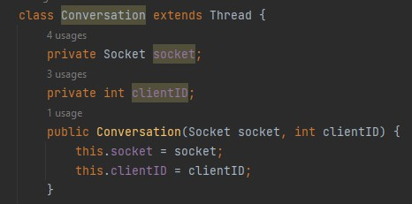
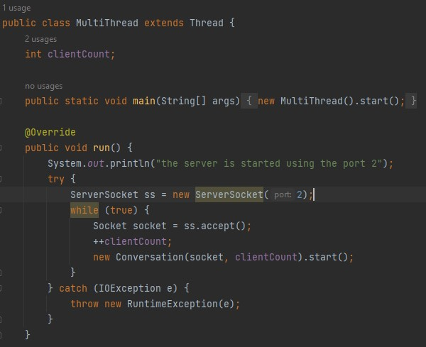
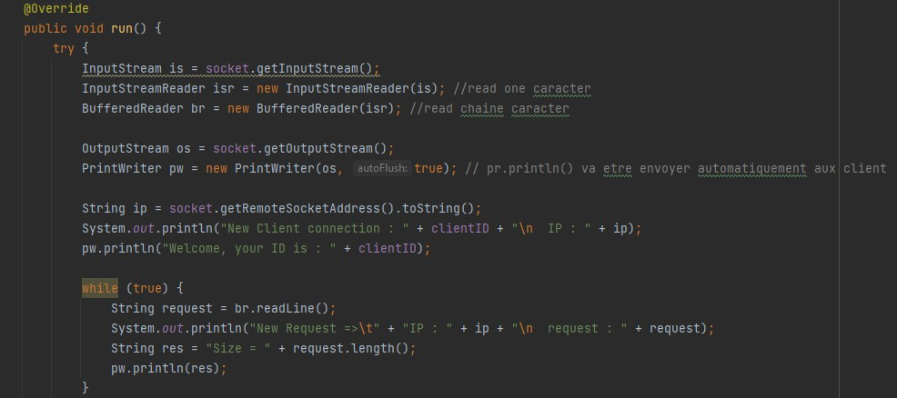
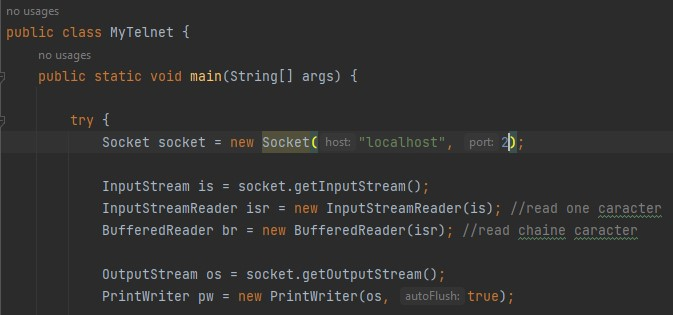

# (2) Bases des systèmes distribués - Programmation Résaux

## Partie 1 : Modèle Multi Threads Blocking IO (java.io)

   #### Développer un serveur de Multi Thread Blocking IO de ChatServer
            la classe "Conversation"
         
         
   ###### Démarrer les conversations
   
   ###### La communication entre 
   
   
   #### Tester le serveur avec un client Telnet
   ###### I/O
   
   ###### new Thread => Communication |serveur| <----> |client|
   
   
   #### Créer un client Java avec une interface graphique JavaFX
   
   #### Créer un client Python ou un autre langage quelconque
      
## Partie 2 : Modèle Single Thread avec Non Blocking IO (java.nio)
   #### Développer un serveur de Single Thread  utilisant des entrées sorties non bloquantes 
   #### Tester le serveur avec un client Telnet, un client java et un client d'un autre langage
      
## Partie 3 : Utiliser un outil Comme JMeeter pour tester les performances des deux serveurs
